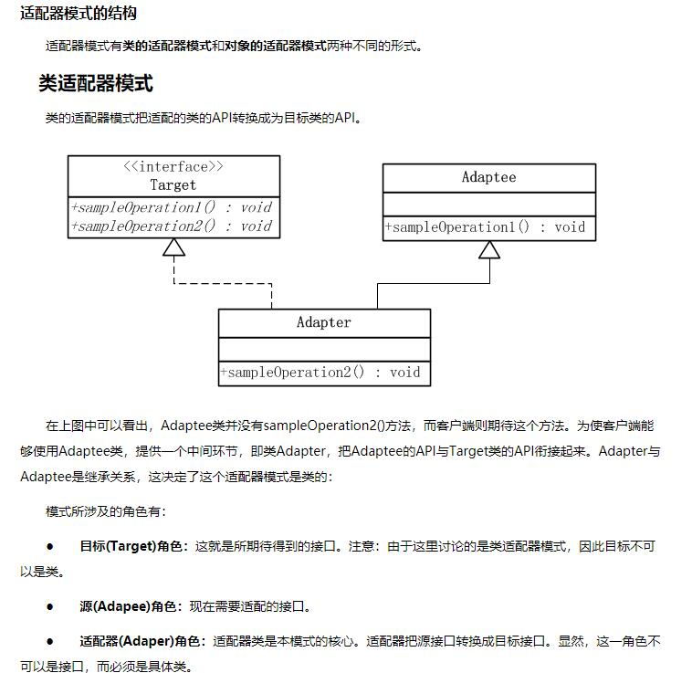

2、对象适配器模式

　　原理：通过组合来实现适配器功能。

　　当我们要访问的接口A中没有我们想要的方法 ，却在另一个接口B中发现了合适的方法，我们又不能改变访问接口A，在这种情况下，我们可以定义一个适配器p来进行中转，这个适配器p要实现我们访问的接口A，这样我们就能继续访问当前接口A中的方法（虽然它目前不是我们的菜），然后在适配器P中定义私有变量C（对象）（B接口指向变量名），再定义一个带参数的构造器用来为对象C赋值，再在A接口的方法实现中使用对象C调用其来源于B接口的方法。

接口适配器模式

　　原理：通过抽象类来实现适配，这种适配稍别于上面所述的适配。

　　当存在这样一个接口，其中定义了N多的方法，而我们现在却只想使用其中的一个到几个方法，如果我们直接实现接口，那么我们要对所有的方法进行实现，哪怕我们仅仅是对不需要的方法进行置空（只写一对大括号，不做具体方法实现）也会导致这个类变得臃肿，调用也不方便，这时我们可以使用一个抽象类作为中间件，即适配器，用这个抽象类实现接口，而在抽象类中所有的方法都进行置空，那么我们在创建抽象类的继承类，而且重写我们需要使用的那几个方法即可