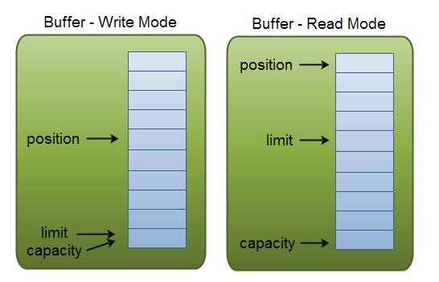

- 通道和缓冲区(*Channels and Buffers*)：在标准I/O API中，使用字符流和字节流。 在NIO中，使用通道和缓冲区。数据总是从缓冲区写入通道，并从通道读取到缓冲区。
- 选择器(*Selectors*)：Java NIO提供了“选择器”的概念。这是一个可以用于监视多个通道的对象，如数据到达，连接打开等。因此，单线程可以监视多个通道中的数据。
- 非阻塞I/O(*Non-blocking I/O*)：Java NIO提供非阻塞I/O的功能。这里应用程序立即返回任何可用的数据，应用程序应该具有池化机制，以查明是否有更多数据准备就绪


Channel和Buffer有好几种类型。下面是JAVA NIO中的一些主要Channel的实现：

- FileChannel	从文件中读写数据。
- DatagramChannel   能通过UDP读写网络中的数据。
- SocketChannel   能通过TCP读写网络中的数据。
- ServerSocketChannel   可以监听新进来的TCP连接，像Web服务器那样。对每一个新进来的连接都会创建一个SocketChannel。

以下是Java NIO里关键的Buffer实现：

- ByteBuffer
- CharBuffer
- DoubleBuffer
- FloatBuffer
- IntBuffer
- LongBuffer
- ShortBuffer

## Selector

​	Selector允许单线程处理多个 Channel。如果你的应用打开了多个连接（通道），但每个连接的流量都很低，使用Selector就会很方便。例如，在一个聊天服务器中。
​	

​	要使用Selector，得向Selector注册Channel，然后调用它的select()方法。这个方法会一直阻塞到某个注册的通道有事件就绪。一旦这个方法返回，线程就可以处理这些事件，事件的例子有如新连接进来，数据接收等。


##### Buffer

​	使用Buffer读写数据一般遵循以下四个步骤：

1. 写入数据到Buffer
2. 调用`flip()`方法
3. 从Buffer中读取数据
4. 调用`clear()`方法或者`compact()`方法

当向buffer写入数据时，buffer会记录下写了多少数据。一旦要读取数据，需要通过flip()方法将Buffer从写模式切换到读模式。在读模式下，可以读取之前写入到buffer的所有数据。

一旦读完了所有的数据，就需要清空缓冲区，让它可以再次被写入。有两种方式能清空缓冲区：调用clear()或compact()方法。clear()方法会清空整个缓冲区。compact()方法只会清除已经读过的数据。任何未读的数据都被移到缓冲区的起始处，新写入的数据将放到缓冲区未读数据的后面。

​	

```java

RandomAccessFile aFile = new RandomAccessFile("data/nio-data.txt", "rw");
FileChannel inChannel = aFile.getChannel();
//create buffer with capacity of 48 bytes
ByteBuffer buf = ByteBuffer.allocate(48);
int bytesRead = inChannel.read(buf); //read into buffer.
while (bytesRead != -1) {
  buf.flip();  //make buffer ready for read
  while(buf.hasRemaining()){
      System.out.print((char) buf.get()); // read 1 byte at a time
  }
  buf.clear(); //make buffer ready for writing
  bytesRead = inChannel.read(buf);
}
aFile.close();

```

### Buffer的capacity,position和limit

缓冲区本质上是一块可以写入数据，然后可以从中读取数据的内存。这块内存被包装成NIO Buffer对象，并提供了一组方法，用来方便的访问该块内存。

为了理解Buffer的工作原理，需要熟悉它的三个属性：

- capacity
- position
- limit

position和limit的含义取决于Buffer处在读模式还是写模式。不管Buffer处在什么模式，capacity的含义总是一样的。

这里有一个关于capacity，position和limit在读写模式中的说明，详细的解释在插图后面。



#### capacity

作为一个内存块，Buffer有一个固定的大小值，也叫“capacity”.你只能往里写capacity个byte、long，char等类型。一旦Buffer满了，需要将其清空（通过读数据或者清除数据）才能继续写数据往里写数据。

#### position

当你写数据到Buffer中时，position表示当前的位置。初始的position值为0.当一个byte、long等数据写到Buffer后， position会向前移动到下一个可插入数据的Buffer单元。position最大可为capacity – 1.

当读取数据时，也是从某个特定位置读。当将Buffer从写模式切换到读模式，position会被重置为0. 当从Buffer的position处读取数据时，position向前移动到下一个可读的位置。

#### limit

在写模式下，Buffer的limit表示你最多能往Buffer里写多少数据。 写模式下，limit等于Buffer的capacity。

当切换Buffer到读模式时， limit表示你最多能读到多少数据。因此，当切换Buffer到读模式时，limit会被设置成写模式下的position值。换句话说，你能读到之前写入的所有数据（limit被设置成已写数据的数量，这个值在写模式下就是position）


### Buffer的分配

要想获得一个Buffer对象首先要进行分配。 每一个Buffer类都有一个allocate方法。下面是一个分配48字节capacity的ByteBuffer的例子。

| `1`  | `ByteBuffer buf = ByteBuffer.allocate(``48``);` |
| ---- | ----------------------------------------------- |
|      |                                                 |

这是分配一个可存储1024个字符的CharBuffer：

| `1`  | `CharBuffer buf = CharBuffer.allocate(``1024``);` |
| ---- | ------------------------------------------------- |
|      |                                                   |

### 向Buffer中写数据

写数据到Buffer有两种方式：

- 从Channel写到Buffer。
- 通过Buffer的put()方法写到Buffer里。

从Channel写到Buffer的例子

| `1`  | `int` `bytesRead = inChannel.read(buf); ``//read into buffer.` |
| ---- | ------------------------------------------------------------ |
|      |                                                              |

通过put方法写Buffer的例子：

| `1`  | `buf.put(``127``);` |
| ---- | ------------------- |
|      |                     |

put方法有很多版本，允许你以不同的方式把数据写入到Buffer中。例如， 写到一个指定的位置，或者把一个字节数组写入到Buffer。 更多Buffer实现的细节参考JavaDoc。

#### flip()方法

flip方法将Buffer从写模式切换到读模式。调用flip()方法会将position设回0，并将limit设置成之前position的值。

换句话说，position现在用于标记读的位置，limit表示之前写进了多少个byte、char等 —— 现在能读取多少个byte、char等。


### 从Buffer中读取数据

从Buffer中读取数据有两种方式：

1. 从Buffer读取数据到Channel。
2. 使用get()方法从Buffer中读取数据。

从Buffer读取数据到Channel的例子：

| `1`  | `//read from buffer into channel.` |
| ---- | ---------------------------------- |
|      |                                    |

| `2`  | `int` `bytesWritten = inChannel.write(buf);` |
| ---- | -------------------------------------------- |
|      |                                              |

使用get()方法从Buffer中读取数据的例子

| `1`  | `byte` `aByte = buf.get();` |
| ---- | --------------------------- |
|      |                             |

get方法有很多版本，允许你以不同的方式从Buffer中读取数据。例如，从指定position读取，或者从Buffer中读取数据到字节数组。更多Buffer实现的细节参考JavaDoc。

### rewind()方法

Buffer.rewind()将position设回0，所以你可以重读Buffer中的所有数据。limit保持不变，仍然表示能从Buffer中读取多少个元素（byte、char等）。

### clear()与compact()方法

一旦读完Buffer中的数据，需要让Buffer准备好再次被写入。可以通过clear()或compact()方法来完成。

如果调用的是clear()方法，position将被设回0，limit被设置成 capacity的值。换句话说，Buffer 被清空了。Buffer中的数据并未清除，只是这些标记告诉我们可以从哪里开始往Buffer里写数据。

如果Buffer中有一些未读的数据，调用clear()方法，数据将“被遗忘”，意味着不再有任何标记会告诉你哪些数据被读过，哪些还没有。

如果Buffer中仍有未读的数据，且后续还需要这些数据，但是此时想要先先写些数据，那么使用compact()方法。

compact()方法将所有未读的数据拷贝到Buffer起始处。然后将position设到最后一个未读元素正后面。limit属性依然像clear()方法一样，设置成capacity。现在Buffer准备好写数据了，但是不会覆盖未读的数据。

### mark()与reset()方法

通过调用Buffer.mark()方法，可以标记Buffer中的一个特定position。之后可以通过调用Buffer.reset()方法恢复到这个position。例如：

| `1`  | `buffer.mark();` |
| ---- | ---------------- |
|      |                  |

| `3`  | `//call buffer.get() a couple of times, e.g. during parsing.` |
| ---- | ------------------------------------------------------------ |
|      |                                                              |

| `4`  |      |
| ---- | ---- |
|      |      |

| `5`  | `buffer.reset();  ``//set position back to mark.` |
| ---- | ------------------------------------------------- |
|      |                                                   |


#### Scatter/Gather

​	分散（scatter）从Channel中读取是指在读操作时将读取的数据写入多个buffer中。因此，Channel将从Channel中读取的数据“分散（scatter）”到多个Buffer中。
聚集（gather）写入Channel是指在写操作时将多个buffer的数据写入同一个Channel，因此，Channel 将多个Buffer中的数据“聚集（gather）”后发送到Channel。	

​	scatter / gather经常用于需要将传输的数据分开处理的场合，例如传输一个由消息头和消息体组成的消息，你可能会将消息体和消息头分散到不同的buffer中，这样你可以方便的处理消息头和消息体。

##### 	**Scattering Reads**

```java
ByteBuffer header = ByteBuffer.allocate(128);
ByteBuffer body   = ByteBuffer.allocate(1024);

ByteBuffer[] bufferArray = { header, body };

channel.read(bufferArray);
```

​	注意buffer首先被插入到数组，然后再将数组作为channel.read() 的输入参数。read()方法按照buffer在数组中的顺序将从channel中读取的数据写入到buffer，当一个buffer被写满后，channel紧接着向另一个buffer中写。

Scattering Reads在移动下一个buffer前，必须填满当前的buffer，这也意味着它不适用于动态消息(译者注：消息大小不固定)。换句话说，如果存在消息头和消息体，消息头必须完成填充（例如 128byte），Scattering Reads才能正常工作。