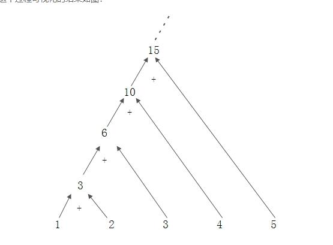

reduce汇聚：

​	Optional<T> reduce(BinaryOperator<T> accumulator);

```java
SysUser sysUser1 = list.stream().reduce((sysUser, sysUser2) -> {
    return sysUser2;
}).get();
```

​	可以看到reduce方法接受一个函数，这个函数有两个参数，第一个参数是上次函数执行的返回值（也称为中间结果），第二个参数是stream中的元素，这个函数把这两个值相加，得到的和会被赋值给下次执行这个函数的第一个参数。要注意的是：**第一次执行的时候第一个参数的值是Stream的第一个元素，第二个参数是Stream的第二个元素**。这个方法返回值类型是Optional，这是Java8防止出现NPE的一种可行方法，后面的文章会详细介绍，这里就简单的认为是一个容器，其中可能会包含0个或者1个对象。




T reduce(T identity, BinaryOperator<T> accumulator);

​	这个定义上上面已经介绍过的基本一致，不同的是：它允许用户提供一个循环计算的初始值，如果Stream为空，就直接返回该值。而且这个方法不会返回Optional，因为其不会出现null值。下面直接给出例子，就不再做说明了。

– count方法：获取Stream中元素的个数。比较简单，这里就直接给出例子，不做解释了。

– 搜索相关
– allMatch：是不是Stream中的所有元素都满足给定的匹配条件
– anyMatch：Stream中是否存在任何一个元素满足匹配条件
– findFirst: 返回Stream中的第一个元素，如果Stream为空，返回空Optional
– noneMatch：是不是Stream中的所有元素都不满足给定的匹配条件
– max和min：使用给定的比较器（Operator），返回Stream中的最大|最小值

```java
ist<Integer&gt; ints = Lists.newArrayList(1,2,3,4,5,6,7,8,9,10);
    System.out.println(ints.stream().allMatch(item -> item < 100));
    ints.stream().max((o1, o2) -&gt; o1.compareTo(o2)).ifPresent(System.out::println);
```


